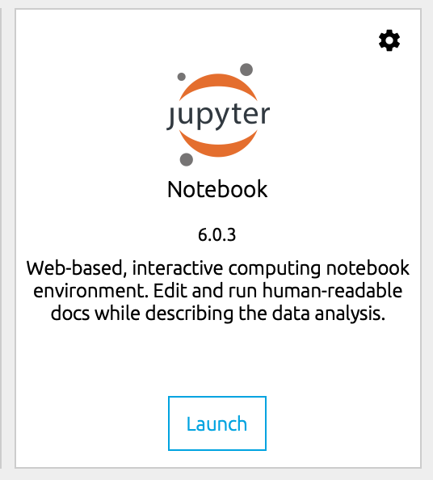
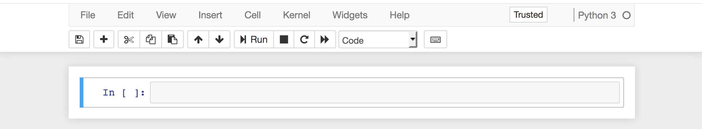
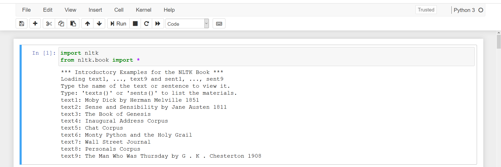
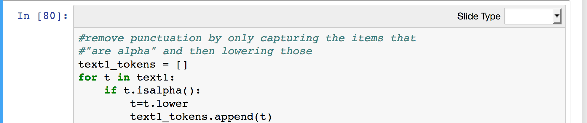
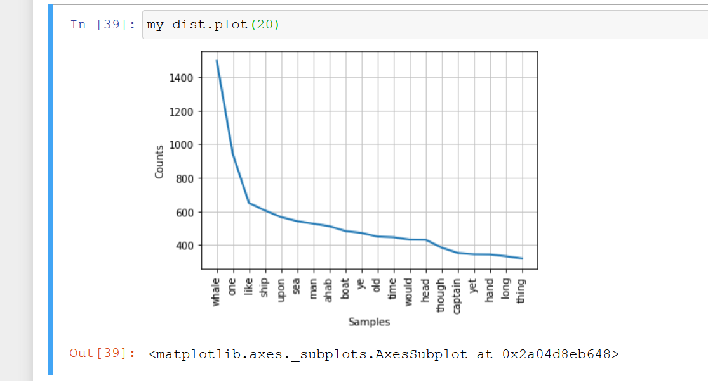

# Overview

This tutorial will give a brief overview of the considerations and tools involved in basic text analysis with Python. By completing this tutorial, you will have a general sense of how to turn text into data using the Python package, NLTK. You will also be able to take publicly available text files and transform them into a corpus that you can perform your own analysis on. Finally, you will have some insight into the types of questions that can be addressed with text analysis.

## Setup and installation

If you have not already installed the [Anaconda](https://www.anaconda.com/download/) distribution of Python 3, please do so.

You will also need [`nltk`](https://github.com/DHRI-Curriculum/install/blob/master/sections/nltk.md) and [`matplotlib`](https://github.com/DHRI-Curriculum/install/blob/master/sections/conda.md) to complete this tutorial. Both packages come installed with Anaconda. To check to be sure you have them, open a new Jupyter Notebook (or any IDE to run Python).

We suggest that you create a directory for the text analysis workshop. You might want to have this directory inside the `Documents` directory, or maybe you already have a `projects` directory. That is really up to you, and your personal preference. This workshop will assume you will create a folder called `text_analysis` on your `Documents` folder, but you should do as you wish. Note: the terms `directories` and `folders` are used interchangeably in the computing world, and we will do the same here.

Find Anaconda Navigator on your computer (it should be located in the folder with your other applications), and from Anaconda Navigator's interface, launch a Jupyter Notebook.



It will open in the browser. All of the directories (folders) in your `home` directory will appear. (This may vary depending on what OS you are using, as the file structure can be different)

We will now open a new file. It is very important that you make sure to open the file in the right place, so you can find it later. Navigate on the directories clicking on them until you are on the desired directory: in our case, `text_analysis`.

Once you are in the right place, select `New` >> `Python3` in the upper right corner.


A blank page with an empty box should appear.



In the box, type:

```python
import nltk
import matplotlib
```

Press `Shift + Enter` to run the cell (or click `run` at the top of the page). We just want to make sure the packages we will need are installed.


If nothing happens, they are installed and you are ready to move on! If you get an error message, check for possible typos. If you typed everything correctly and still got an error message, you probably don't have `nltk` and/or `matplotlib` installed. (As we mentioned before, both should come by default when you install `Anaconda`. A quick possible fix is to open your `terminal` (NOT the Jupyter Notebook file) and type:

```console
$ conda install nltk -y
$ conda install matplotlib -y
```

## Downloading the corpus

Now we need to install the nltk corpus. This is very large and may take some time if you are on a weak connection.

In the next cell, type:

```python
nltk.download()
```

and run the cell.

The NLTK downloader should appear. Please install all of the packages. If you are short on time, focus on "book" for this tutorial—you can download the other packages at another time for later use.

Yours will look a little different, but the same interface. Click on the 'all' option and then 'Download'. Once they all trun green, you can close the Downloader dialogue box.


Return to your Jupyter Notebook and type:

```python
from nltk.book import *
```

A list of books should appear. If this happens, great! If not, return to the downloader to make sure everything is ok.



Close this Notebook without saving — the only purpose was to check if we have the appropriate packages installed. You can save it if you want to come back in the future and see how you did it, but once you have them installed in your computer, you will not have to do that again.

# Text as Data

When we think of "data," we often think of numbers, things that can be summarized, statisticized, and graphed. Rarely when I ask people "what is data?" do they respond "_Moby Dick_." And yet, more and more, text is data. Whether it is _Moby Dick_, or every romance novel written since 1750, or today's newspaper or twitter feed, we are able to transform written (and spoken) language into data that can be quantified and visualized. That has been done for a while, but now we can do it in a much larger scale, in a much faster way.

## Corpora

The first step in gathering insights from texts is to create a **corpus**. A corpus is a collection of texts that are somehow related to each other. For example, the [Corpus of Contemporary American English](https://corpus.byu.edu/coca/), [Donald Trump's Tweets](http://www.trumptwitterarchive.com/), [text messages](https://byts.commons.gc.cuny.edu/) sent by bilingual young adults, [digitized newspapers](https://chroniclingamerica.loc.gov/newspapers/), or [books](https://www.gutenberg.org/) in the public domain are all corpora. There are infinitely many corpora, and, sometimes, you will want to make your own—that is, one that best fits your research question.

The route you take from here will depend on your research question. Let's say, for example, that you want to examine gender differences in writing style. Based on previous linguistic research, you hypothesize that male-identified authors use more definitives than female-identified. So you collect two corpora—one written by men, one written by women—and you count the number of *the*s, *this*s, and *that*s compared to the number of *a*s, *an*s, and *one*s. Maybe you find a difference, maybe you don't. We can already see that this is a relatively crude way of going about answering this question, but it is a start.

Keep in mind that, oftentimes our analysis of gender assumes pre-existing gender roles that reproduce gender as a binary system. Some digital humanists have pointed out that, if gender is binary, then the relation between male and female will likely be one of opposition. As [Laura Mandell](https://dhdebates.gc.cuny.edu/read/untitled-f2acf72c-a469-49d8-be35-67f9ac1e3a60/section/5d9c1b63-7b60-42dd-8cda-bde837f638f4#ch01) says, the categories of "male" and "female" are socially constructed, and quantitative analysis practitioners should avoid jumping to conclusions about "male" and "female" styles of thinking and writing "as if the M/F terms were simple pointers to an unproblematic reality, transparently referential and not discursively constituted."

There has been some research about how the [linguistic complexity of written language](http://science.sciencemag.org/content/sci/331/6014/176.full.pdf) in long-form pieces (i.e., books, articles, letters, etc.) has decreased over time. Simply put, people today use shorter sentences with fewer embedded clauses and complex tense constructions than people did in the past. (Note that this is not necessarily a bad or good thing.) Based on this research, we want to know if short-form platforms are emblematic of the change (we predict that they are based on our own experience with short-form platforms like email and Twitter). One way to do this would be to use Part-of-Speech tagging. Part-of-Speech (POS) tagging is a way to identify the category of words in a given text.

For example, the sentence:

> I like the red bicycle.

has one pronoun, one verb, one determiner, one adjective, and one noun.

> (I : Pronoun), (like : Verb), (the : Determiner), (red : Adjective), (bicycle : Noun)

NLTK uses the [Penn Tree Bank Tag Set](https://www.ling.upenn.edu/courses/Fall_2003/ling001/penn_treebank_pos.html). This is a very detailed tag list that goes far beyond just nouns, verbs, and adjectives, but gives insight into different types of nouns, prepositions, and verbs as well. Virtually all POS taggers will create a list of (word, POS) pairs. If newspaper articles have a higher ratio of function words (prepositions, auxiliaries, determiners, etc.) to semantic words (nouns, verbs, adjectives), than tweets, then we have one piece of evidence supporting our hypothesis. It's important to note here that we must use either ratios or otherwise normalized data (in the sense that raw numbers will not work). Because of the way that language works (function words are often repeated, for example), a sample of 100 words will have more unique words than a sample of 1,000. Therefore, to compare different data types (articles vs. tweets), this fact should be taken into account.

## Evaluation

Check all sentences below that are correct:

- A text is not data in itself, but can produce data if converted into numbers.
- Part-of-Speech (POS) tagging can help identifying verbs, adjectives and nouns in a text.
- A corpus is any collection of texts, independently of being related to each other or not.

# Cleaning and Normalizing

Generally, however, our questions are more about topics rather than writing style. So, once we have a corpus—whether that is one text or millions—we usually want to clean and normalize it. There are three terms we are going to need:

- **Text normalization** is the process of taking a list of words and transforming it into a more uniform sequence. Usually, this involves removing punctuation, making the words all the same case, removing _stop words_, and either _stemming_ or _lemmatizing_ the words. It can also include expanding abbreviations or matching misspellings (but these are advanced practices that we will not cover).

You probably know what removing punctuation and capitalization refer to, but the other terms may be new:

- **Stop words** are words that appear frequently in a language, often adding grammatical structure, but little semantic content. There is no official list of stop words for any language, though there are some common, all-purpose lists built in to NLTK. However, different tasks require different lists. The purpose of removing stop words is to remove words that are so common that their meaning is diminished across a large number of texts.

- **Stemming and lemmatizing** both of these processes try to consolidate words like "laughs" and "laughing" to  "laugh" since they all mean essentially the same thing, they are just inflected differently. So again, in an attempt to reduce the number of words, and get a realistic understanding of the meaning of a text, these words are collapsed. Stemming does this by cutting off the end (very fast), lemmatizing does this by looking up the dictionary form (very slow).

Language is messy, and created for and by people, not computers. There is a lot of grammatical information in a sentence that a computer cannot use. For example, I could say to you:

> The house is burning.

and you would understand me. You would also understand if I say

> house burn.

The first has more information about tense, and which house in particular, but the sentiment is the same either way.

In going from the first sentence to the normalized words, we removed the stop words (_the_ and _is_), and removed punctuation and case, and lemmatized what was left (_burning_ becomes _burn_—though we might have stemmed this, its impossible to tell from the example). This results in what is essentially a "bag of words," or a corpus of words without any structure. Because normalizing your text reduces the number of words (and therefore the number of dimensions in your data), and keeps only the words that contribute meaning to the document, this cleaning is usually desirable.

This is a very important topic in Machine Learning tutorials. For the time being, we just need to know that there is "clean" and "dirty" versions of text data. Sometimes our questions are about the clean data, but sometimes our questions are in the "dirt."

A Note on Ethics:

The act of cleaning/normalizing subscribes text to predetermined categories of meaning, forcing meaning into existing "boxes," so to speak. This doesn't mean that we should avoid cleaning or normalizing text, but that we should be aware of how some textual reductions have the potential to affect meaning. How does quantification reinforce differences or stratifications within our data? We have to be careful about the kinds of questions we are asking, and how we might be reproducing some of our assumptions in our inquiry.

To read more about ethics and text analysis, see Lauren Klein's "[Distant Reading After Moretti](https://arcade.stanford.edu/blogs/distant-reading-after-moretti)," where she questions, "Instead of first asking what can be modeled—what phenomena we can track at scale—we might instead ask: what might be hidden in this corpus?”

## Evaluation

Check all sentences below that are correct:

- Stop words are useless for text analysis, therefore the first step in any project is to remove them from the text.

- In text analysis, as in other types of data analysis, we usually want to cleanse the data in order to prepare it for the analysis. In text analysis, this process is called "text normalization" and can involve tasks such as removing undesired words and punctuation.

- Textual alterations can potentially change the original intended meaning. Therefore, we must strive to work with the data exactly as it is in the source.

# Using the NLTK Corpus

In the following sections, we are going to learn how to work with the NLTK Corpus and go through a series of methods that come built-in to NLTK that allow us to turn our words into numbers and visualizations.

All of the code for this section is in a [Jupyter Notebook file: NEED LINK](https://github.com/DHRI-Curriculum/text-analysis). You should download it and save it on your desired folder. Here, we are assuming you are saving in on the `text_analysis` folder.

In this file you will find all of the workshop commands and the expected outputs. If you ever feel stuck or can't seem to be able to advance in the workshop, you can open this file and see how we did it. Feel free to open the file right now (click on it), take a peek at its contents if you want, and close it.

To do it, open your Jupyter Notebook, just like you did in the [Install instructions - NEED LINK](www.temporarylinktonltkinstructions.fake), and navigate to the `text_analysis` directory. Click on the `TextAnalysisWalkthrough.ipynb` file. Once you are done, just close the tab. 

For the best possible experience, we suggest/encourage you to:

  - Create an ipynb file and follow the workshop typing all the code yourself.
  - Avoid copying/pasting the code. Much of learning has to do with you typing yourself.
  - Only check the `TextAnalysisWalkthrough.ipynb` file if you get lost or if you are not able to get the right output. Before opening it, put some time trying to figure out by yourself why it isn't working. A big part of coding is learning to identify what we are doing wrong.
  - I would also caution you against working with both files open at the same time. It is easy to get confused and start modifying the wrong one.

But those are only suggestions. Maybe they will work for you, maybe they won't, so feel free to do as it best suit you. You are in charge here! 

## Creating a Jupyter Notebook file

Now you will create your Jupyter notebook file, in which you will run the workshop. Return to the Jupyter Home Tab in your Browser (or, if you closed it completely, launch the Jupyter Notebook again), and start a New Python3 Notebook using the `New` button in the upper right corner.

Even though Jupyter Notebook doesn't force you to do so, it is very important to name your file, or you will end up later with a bunch of untitled files and you will have no idea what they are about. In the top left, click in the word `Untitled` and give your file a name such as "intro_nltk".

In the first blank cell, type the following to import the NLTK library:

```python
import nltk
```

**Libraries** are sets of instructions that Python can use to perform specialized functions. The Natural Language ToolKit (`nltk`) is one such library. As the name suggests, its focus is on language processing.

We will also need the matplotlib library later on, so import it now:

```python
import matplotlib
```

`matplotlib` is a library for making graphs. In the middle of this tutorial, we are going to make a dispersion plot of words in our texts.

Finally, because of a quirk of Jupyter notebooks, we need to specify that matplotlib should display its graphs in the notebook (as opposed to in a separate window), so we type this command (this is technically a Jupyter command, not Python):

```python
%matplotlib inline
```

All three of these commands can be written in the same cell and run all at once (`Shift + Enter`) or in different cells.


If you don't see an error when you run the notebook—that is, if there is no output—you can move on to the next step. It is not rare in programming that when you do things right, the result will be nothing happening. This is what we like to call a _silent success_.

Next, we need to load all of the NLTK corpora into our program. Even though we downloaded them to our computer, we need to tell Python we want to use them.

```python
from nltk.book import *
```

The pre-loaded NLTK texts should appear again. These are preformatted data sets. We will still have to do some minor processing, but having the data in this format saves us a few steps. At the end of this tutorial, we will make our own corpus. This is a special type of python object specific to NLTK (it isn't a string, list, or dictionary). Sometimes it will behave like a string, and sometimes like a list of words.


If you got any error messages, check the code and make sure you typed everything correctly. Even spaces before words matter!

If you are sure you are running the code correctly, you probably have an installing issue, so you might have to go back to the instalation instructions to figure it out.

# Searching For Words

Let's start by analyzing _Moby Dick_, which is `text1` for NLTK.

The first function we will look at is `concordance`. "Concordance" in this context means the characters on either side of the word. Our text is behaving like one giant string, so concordance will just count the number of characters on either side. By default, this is 25 characters on either side of our target word (including spaces), but [you can change that if you want](http://www.nltk.org/_modules/nltk/text.html#Text.concordance).

In the Jupyter Notebook, type:

```python
text1.concordance("whale")
```

The output shows us the 25 characters on either side of the word "whale" in _Moby Dick_. Let's try this with another word, "love." Just replace the word "whale" with "love," and we get the contexts in which Melville uses "love" in _Moby Dick_. `concordance` is used (behind the scenes) for several other functions, including `similar` and `common_contexts`.

Let's now see which words appear in similar contexts as the word "love." NLTK has a built-in function for this as well: `similar`.

```python
text1.similar("love")
```

Behind the scenes, Python found all the contexts where the word "love" appears. It also finds similar environments, and then what words were common among the similar contexts. This gives a sense of what other words appear in similar contexts. This is somewhat interesting in itself, but more interesting if we compare it to something else. Let's take a look at another text. What about _Sense and Sensibility_? Let's see what words are similar to "love" in Jane Austen's writing. In the next cell, type:

```python
text2.similar("love")
```

We can compare the two and see immediately that Melville and Austen use the word "love" differently.

## Investigating "lol"

Let's expand from novels for a minute and take a look at the NLTK Chat Corpus. In chats, text messages, and other digital communication platforms, "lol" is exceedingly common. We know it doesn't simply mean "laughing out loud"—maybe the `similar` function can provide some insight into what it does mean.

```python
text5.similar("lol")
```

The resulting list is a lot of greetings, indicating that "lol" probably has more of a [phatic function](http://www.oxfordreference.com/view/10.1093/oi/authority.20110803100321840). Phatic language is language primarily for communicating social closeness. Phatic words stand in contrast to semantic words, which contribute meaning to the utterance.

If you are interested in this type of analysis, take a look at the `common_contexts` function in the [NLTK book](https://www.nltk.org/book/) or in the [NLTK docs](https://www.nltk.org/).

## Evaluation

Check all sentences below that are correct:


- The similar method brings a list of words that are similiar in writing, but not necessarily in meaning, like "whale" and "while".

- Using the `concordance` method with a specific word, such as "whale", returns the words that surround "whale" in different sentences, helping us to get a glimpse of the contexts in which the word "whale" shows up.

# Positioning Words

In many ways, `concordance` and `similar` are heightened word searches that tell us something about what is happening near the target words. Another metric we can use is to visualize where the words appear in the text. In the case of _Moby Dick_, we want to compare where "whale" and "monster" appear throughout the text. In this case, the text is functioning as a list of words, and will make a mark where each word appears, offset from the first word. We will _pass_ this _function_ a _list_ of _strings_ to plot. In the next cell, type:

```python
text1.dispersion_plot(["whale", "monster"])
```

A graph should appear with a tick mark everywhere that "whale" appears and everywhere that "monster" appears. Knowing the story, we can interpret this graph and align it to what we know of how the narrative progresses, helping us develop a visual of the story — where the whale goes from being a whale to being a monster to being a whale again. If we did not know the story, this could give us hints of the narrative arc.

## Challenge

Try this with `text2`, _Sense and Sensibility_, [as we saw here](#downloading-the-corpus). Some relevant words are "marriage," "love," "home," "mother," "husband," "sister," and "wife." Pick a few to compare. You can compare an unlimited number, but it's easier to read a few at a time. (Note that the comma in our writing here is _inside_ the quotation mark, because that is how proper English grammar works. However, in Python, you would have to put commas _outside_ of the quotation marks to create a _list_.)

NLTK has many more functions built-in, but some of the most powerful functions are related to cleaning, part-of-speech tagging, and other stages in the text analysis pipeline (where the pipeline refers to the process of loading, cleaning, and analyzing text).

## Solution

```python
text2.dispersion_plot(["love", "marriage"])
```

```python
text2.dispersion_plot(["husband", "wife"])
```

## Evaluation

- You can get a visual representation of ocurrences of a word with the dispersion_plot `method`.

- The `dispersion_plot` method allows you to input a list of strings, as long as you split them with commas.

- Contrary to grammar rule, in a list of strings, the commas must come outside of the quotation marks.

# Types vs. tokens

We will now turn our attention away from the NLTK library and work with our text using the /built-in Python functions/, the ones that come included with the Python language, rather than the NLTK library. (This difference is relevant because built-in python functions will work with any list of strings, while some of the functions that are specific to the NLTK library will require you to make your text "nltk ready". Don't worry about that now, we will show you how to do it later in this workshop).

First, let's find out how many times a given word appears in the corpus. In this case (and all cases going forward), our text will be treated as a list of words. Therefore, we will use the `count` function. We could just as easily do this with a text editor, but performing this in Python allows us to save it to a variable and then utilize this statistic in other calculations (for example, if we want to know what percentage of words in a corpus are 'lol', we would need a count of the 'lol's). In the next cell, type:

```python
text1.count("whale")
```

We see that "whale" occurs 906 times, but that seems a little low. Let's check the same thing, but now for "Whale" and "WHALE":

```python
text1.count("Whale")
```

```python
text1.count("WHALE")
```

What is clear here is that the `count` method is case-sensitive.
"Whale" with a capital "W" appears 282 times, and "WHALE" another 38 times. Depending on the type of analysis, this distinction can be a problem, and we might want "whale", "Whale" and "WHALE" to be collapsed into one single word. We will deal with that in a moment. For the time being, we will accept that we have three different entries for "whale."

This gets at a distinction between **type** and **token**. "Whale" and "whale" are different types (as of now) because they do not match identically. Every instance of "whale" in the corpus is another **token**—it is an instance of the type, "whale." Therefore, there are 906 tokens of "whale" in our corpus, 282 tokens of "Whale" and 38 tokens of "WHALE".

But that's not what we want. Let's fix this by making all of the words lowercase. We will make a new list of words, and call it "text1_tokens". We will fill this list with all the words in text1, but in their lowercase form. Python has a built-in function, `lower()` that takes all letters and makes them lowercase. In this same step, we are going to do a kind of tricky move, and only keep the words that are alphabetical and pass over anything that is punctuation or numbers. There is a built-in function, `isalpha()`, that will allow us to save only those words that are made of letters. If `isalpha()` is true, we'll make the word lowercase, and keep the word. If not, we'll pass over it and move to the next one.

Type the following code into a new cell in your notebook. Pay special attention to the indentation, which must appear as below. (Note that in Jupyter Notebook, indentation usually comes automatically. If not, make sure to type the `space` key 4 times)

```python
text1_tokens = []
for t in text1:
  if t.isalpha():
    t = t.lower()
    text1_tokens.append(t)
```



Another way to perform the same action more tersely is to use what's called a [list comprehension](https://docs.python.org/3/tutorial/datastructures.html#list-comprehensions). A list comprehension is a shorter, faster way to write a for-loop. It is syntactically a little more difficult to read (for a human), but, in this case, it's much faster to process. Don't worry too much about understanding the syntax of list comprehensions right now, just try to recognize on it the elements you've seen in the for loop. For every example, we will show both the for loop and list comprehension options.

```python
text1_tokens = [t.lower() for t in text1 if t.isalpha()]
```

Let's take a breath, because this was a difficulty spike. For loops are weird and not super intuitive. It usually takes some time for us to get used to them.

I suggest going back to the loop above, review it, try to understand why all indentations are where they are. 

Feel like you understand it? Try deleting it and writing the loop yourself without looking at this guide.

You can also copy the whole loop to a new jupyter notebook cell and play around with it. What happens when you change the order of the commands? How about the indentation? Don't be afraid to break it.

If you feel like you are done playing with the loop, time to move to the next section to see the results.

## Evaluation

Check all sentences below that are correct:

- "Whale", "WHALE", and "whale" are all different tokens of the same type.

- The `lower()` method returns the lowercase form of all of the alphabetical characters in a string.

- The `isalpha()` method transforms integers in alphabetical strings.

- The `append()` method adds an item to the end of the list.

# Length and unique words

Great! Now `text1_tokens` is a list of all of the tokens in our corpus, with the punctuation removed, and all the words in lowercase. Let's check it:

```python
text1_tokens.count("whale")
```

And now we have 1226 tokens for "whale", which is the exact some of the counts we did before. To double check, count "Whale" and "WHALE" again and you should see no results for them. 

Now we want to know how many words there are in our corpus—that is, how many tokens in total. Therefore, we want to ask, "What is the length of that list of words?" Python has a built-in `len` function that allows you to find out the length of many types. Pass it a list, and it will tell you how many items are in the list. Pass it a string, and it will tell you how many characters are in the string. Pass it a dictionary, and it will tell you how many items are in the dictionary. In the next cell, type:

```python
len(text1_tokens)
```

Just for comparison, check out how many words were in "text1"—before we removed the punctuation and the numbers.

```python
len(text1)
```

We see there are over 218,000 words in _Moby Dick_ (including metadata). But this is the number of words total—we want to know the number of unique words. That is, we want to know how many _types_, not just how many tokens.

In order to get unique words, rather than just all words in general, we will make a **set** from the list. A `set` in Python work just like it would [in math](https://en.wikipedia.org/wiki/Set_(mathematics)), it's all the unique values, with any duplicate items removed.

So let's find out the length of our set. just like in math, we can also nest our functions. So, rather than saying `x = set(text1_tokens)` and then finding the length of "x", we can do it all in one step.

```python
len(set(text1_tokens))
```

# Lexical density

Now we can calculate the **lexical density**, the number of unique words per total words. [Statistical studies](https://pdfs.semanticscholar.org/c2a8/56959d7f5880c98ccd4cfeb4b4f5b7133ec7.pdf) have shown that lexical density is a good metric to approximate lexical diversity—the range of vocabulary an author uses. For our first pass at lexical density, we will simply divide the number of unique words by the total number of words:

```python
len(set(text1_tokens))/len(text1_tokens)
```

If we want to use this metric to compare texts, we immediately notice a problem. Lexical density is dependent upon the length of a text and therefore is strictly a comparative measure. It is possible to compare 100 words from one text to 100 words from another, but because language is finite and repetitive, it is not possible to compare 100 words from one to 200 words from another. Even with these restrictions, lexical density is a useful metric in grade level estimations, [vocabulary use](http://www.mdpi.com/2226-471X/2/3/7) and genre classification, and a reasonable proxy for lexical diversity.

Let's take this constraint into account by working with only the first 10,000 words of our text. First we need to slice our list, returning the words in position 0 to position 9,999 (we'll actually write it as "up to, but not including" 10,000).

```python
text1_slice = text1_tokens[0:10000]
```

Now we can do the same calculation we did above:

```python
len(set(text1_slice)) / len(text1_slice)
```

This is a much higher number, though the number itself is arbitrary. When comparing different texts, this step is essential to get an accurate measure.

## Challenge

Let's compare the lexical density of *Moby Dick* with *Sense and Sensibility*. Make sure to:

1. Make all the words lowercase and remove punctuation.
2. Make a slice of the first 10,000 words.
3. Calculate lexical density by dividing the length of the set of the slice by the length of the slice.

Remember to be aware of the ethical implications for the conclusions that we might draw about our data. What assumptions might we be reifying about these writers?

## Solution

```python
text2_tokens = []
for t in text2:
  if t.isalpha():
    t = t.lower()
    text2_tokens.append(t)

text2_slice = text2_tokens[0:10000]

len(set(text2_slice)) / len(text2_slice)
```

## Evaluation

Check all sentences below that are correct:

- The `len` method returns the length of the input, which can mean different things depending on its type. If it is a string, it will return the number of characters; if it is a list or dictionary, it will return the number of items.

- The lexical density measures the number of unique words per total word, and it is an objective measure of writing quality.

- Comparing the lexical density between texts of different sizes can give a problematic result. A possible solution is to use list slice and compare parts of both texts of a similar size.

# Data Cleaning: removing Stopwords

Thus far, we have been asking questions that take stopwords and grammatical features into account. For the most part, we want to exclude these features since they don't actually contribute very much semantic content to our models. Therefore, we will:

1. Remove capitalization and punctuation (we've already done this).
2. Remove stop words.
3. Lemmatize (or stem) our words, i.e. "jumping" and "jumps" become "jump."

We already completed step one, and are now working with our `text1_tokens`. Remember, this variable, `text1_tokens`, contains a list of strings that we will work with. We want to remove the stop words from that list. The NLTK library comes with fairly comprehensive lists of stop words for many languages. Stop words are function words that contribute very little semantic meaning and most often have grammatical functions. Usually, these are function words such as determiners, prepositions, auxiliaries, and others.

To use NLTK's stop words, we need to import the list of words from the corpus. (We could have done this at the beginning of our program, and in more fully developed code, we would put it up there, but this works, too.) In the next cell, type:

```python
from nltk.corpus import stopwords
```

We need to specify the English list, and save it into its own variable that we can use in the next step:

```python
stops = stopwords.words('english')
```

Now let's take a look at those words:

```python
print(stops)
```

Now we want to go through all of the words in our text, and if that word is in the stop words list, remove it from our list. Otherwise, we want it to skip it. (The code below is slow, so it may take some time to process). The way we can write this in Python is:

```python
text1_stops = []
for t in text1_tokens:
    if t not in stops:
        text1_stops.append(t)
```

A faster option, if you are feeling bold, would be using list comprehension: 

```python
text1_stops = [t for t in text1_tokens if t not in stops]
```

To check the result:

```python
print(text1_stops[:30])
```

## Verifying List Contents

Now that we removed our stop words, let's see how many words are left in our list:

```python
len(text1_stops)
```

You should get a much lower number.

For reference, let's also check how many unique words there are. We will do this by making a set of words. Sets are the same in Python as they are in math, they are all of the unique words rather than all the words. So, if "whale" appears 200 times in the list of words, it will only appear once in the set.

```python
len(set(text1_stops))
```

## Evaluation

Check all sentences below that are correct:

- Stop words are words that usually don't contribute with much semantic content, like prepositions, determiners, etc.

- To use stopwords we need to import them from the nltk corpus, using the following code: `import stopwords from nltk.corpus`

- List comprehensions are faster ways of iterating and creating lists when compared with for loops.

# Data cleaning: Lemmatizing Words

Now that we've removed the stop words from our corpus, the next step is to stem or lemmatize the remaining words. This means that we will strip off the grammatical structure from the words. For example, `cats —> cat`, and `walked —> walk`. If that was all we had to do, we could stem the corpus and achieve the correct result, because stemming (as the name implies) really just means cutting off affixes to find the root (or the stem). Very quickly, however, this gets complicated, such as in the case of `men —> man` and `sang —> sing`. Lemmatization deals with this by looking up the word in a reference and finding the appropriate root (though note that this still is not entirely accurate). Lemmatization, therefore, takes a relatively long time, since each word must be looked up in a reference. NLTK comes with pre-built stemmers and lemmatizers.

We will use the WordNet Lemmatizer from the NLTK Stem library, so let's import that now:

```python
from nltk.stem import WordNetLemmatizer
```

Because of the way that it is written "under the hood," an instance of the lemmatizer needs to be called. We know this from reading [the docs](https://www.nltk.org/).

```python
wordnet_lemmatizer = WordNetLemmatizer()
```

Let's quickly see what lemmatizing does.

```python
wordnet_lemmatizer.lemmatize("children")
```

Now try this one:

```python
wordnet_lemmatizer.lemmatize("better")
```

It didn't work, but...

```python
wordnet_lemmatizer.lemmatize("better", pos='a')
```

... sometimes we can get better results if we define a specific part of speech(pos). "a" is for "adjective", as we learned [here](http://www.nltk.org/_modules/nltk/corpus/reader/wordnet.html).

Now we will lemmatize the words in the list.

```python
text1_clean = []
for t in text1_stops:
    t_lem = wordnet_lemmatizer.lemmatize(t)
    text1_clean.append(t_lem)
```

And again, there is a faster version for you to use once you feel comfortable with list comprehensions:


```python
text1_clean = [wordnet_lemmatizer.lemmatize(t) for t in text1_stops]
```

## Verifying Clean List Contents

Let's check now to see the length of our final, cleaned version of the data, and then check the unique set of words. Notice how we will use the `print` function this time. Jupyter Notebook does print commands without the `print` function, but it will only print one thing per cell (the last command), and we wanted to print two different things:

```python
print(len(text1_clean))
print(len(set(text1_clean)))
```

If everything went right, you should have the same length as before, but a smaller number of unique words. That makes sense since we did not remove any word, we only changed some of them.

Now if we were to calculate lexical density, we would be looking at how many word stems with semantic content are represented in *Moby Dick*, which is a different question than the one in our first analysis of lexical density.

Why don't you try that by yourself? Try to remember how to calculate lexical density without looking back first. It is ok if you have forgotten.

Now let's have a look at the words Melville uses in _Moby Dick_. We'd like to look at all of the _types_, but not necessarily all of the _tokens._ We will order this set so that it is in an order we can handle. In the next cell, type:

```python
sorted(set(text1_clean))[:30]
```

`Sorted` + `set` should give us a list of list of all the words in *Moby Dick* in alphabetical order, but we only want to see the first ones. Notice how there are some words we wouldn't have expected, such as 'abandon', 'abandoned', 'abandonedly', and 'abandonment'. This process is far from perfect, but it is useful. However, depending on your goal, a different process, like `stemming` might be better. 


## Evaluation

Check all sentences below that are correct:

- Stemming and Lemmatizing are different forms of reducing word variations to their roots.

- `sorted(set(list_of_strings))` returns the unique items of `list_of_strings` in alphabetical order.

# Data cleaning: Stemming Words

The code to implement this and view the output is below:

```python
from nltk.stem import PorterStemmer
porter_stemmer = PorterStemmer()
```

The Porter is the most common Stemmer. Let's see what stemming does to words and compare it with lemmatizers:

```python
print(porter_stemmer.stem('berry'))
print(porter_stemmer.stem('berries'))
print(wordnet_lemmatizer.lemmatize("berry"))
print(wordnet_lemmatizer.lemmatize("berries"))
```

Stemmer doesn't look so good, right? But how about checking how stemmer handles some of the words that our lemmatized "failed" us?

```python
print(porter_stemmer.stem('abandon'))
print(porter_stemmer.stem('abandoned'))
print(porter_stemmer.stem('abandonedly'))
print(porter_stemmer.stem('abandonment'))
```

Still not perfect, but a bit better. So the question is, how to choose between stemming and lemmatizing? As many things in text analysis, that depends. The best way to go is experimenting, seeing the results and chosing the one that better fits your goals.

As a general rule, stemming is faster while lemmatizing is more accurate (but not always, as we just saw). For academics, usually the choice goes for the latter.

Anyway, let's stem our text with the Porter Stemmer:

```python
t1_porter = []
for t in text1_clean:
    t_stemmed = porter_stemmer.stem(t)
    t1_porter.append(t_stemmed)
```

Or, if we want a faster way:

```python
t1_porter = [porter_stemmer.stem(t) for t in text1_clean]
```

And let's check the results:

```python
print(len(set(t1_porter)))
print(sorted(set(t1_porter))[:30])
```

A very different list of words is produced. This list is shorter than the list produced by the lemmatizer, but is also less accurate, and some of the words will completely change their meaning (like 'berry' becoming 'berri').

## Evaluation

Check all sentences below that are correct:

- Both Stemming and Lemmatizing are far from perfect, so they must be used with caution.

- There is no obvious best choice between Stemmers and Lemmatizers, so the best way to go is experimenting and seeing what results better fit your goals.

# Data cleaning: results

Now that we've seen some of the differences between both, we will proceed using our lemmatized corpus, which we saved as "text1_clean":

```python
my_dist = FreqDist(text1_clean)
```

If nothing happened, that is normal. Check to make sure it is there by calling for the type of the "my_dist" object.

```python
type(my_dist)
```

The result should say it is a nltk probability distribution (`nltk.probability.FreqDist`). It doesn't matter too much right now what that is, only that it worked. We can now plot this with the matplotlib function, `plot`. We want to plot the first 20 entries of the my_dist object.

```python
my_dist.plot(20)
```



We've made a nice image here, but it might be easier to comprehend as a list. Because this is a special probability distribution object we can call the `most_common` on this, too. Let's find the twenty most common words:

```python
my_dist.most_common(20)
```

What about if we are interested in a list of specific words—perhaps to identify texts that have biblical references. Let's make a (short) list of words that might suggest a biblical reference and see if they appear in _Moby Dick_. Set this list equal to a variable:

```python
b_words = ['god', 'apostle', 'angel']
```

Then we will loop through the words in our cleaned corpus, and see if any of them are in our list of biblical words. We'll then save into another list just those words that appear in both.

```python
my_list = []
for word in b_words:
    if word in text1_clean:
        my_list.append(word)
    else:
        pass
```

And then we will print the results.

```python
print(my_list)
```

You can obviously do this with much larger lists and even compare entire novels if you wish, though it would take a while with this approach. You can use this to get similarity measures and answer related questions.

## Challenge

a) Try to get the same result of the loop above (the one with "my_list"), but this time with a list comprehension. Save this other list as "my_list2".

b) Compare both lists to see if they are identical.

## Solution

a)
```python
my_list2 = [word for word in b_words if word in text1_clean]
```

b)
```python
my_list == mylist2
```

## Evaluation

Check all sentences below that are correct:

- We can create a frequency distribution of a list of strings with `FreqDist` and plot it with the `plot` method.

- `my_dist.most_common(50)` will check the first 50 words in the distribution and return you the most common one among them.

# Make Your Own Corpus

Now that we have seen and implemented a series of text analysis techniques, let's go to the Internet to find a new text. You could use something such as historic newspapers, or Supreme Court proceedings, or use any txt file on your computer. Here we will use [Project Gutenberg](http://www.gutenberg.org). Project Gutenberg is an archive of public domain written works, available in a wide variety of formats, including .txt. You can download these to your computer or access them via the url. We'll use the `url method`. We found *Don Quixote* in the archive, and will work with that.

The Python package, urllib, comes installed with Python, but is inactive by default, so we still need to import it to utilize the functions. Since we are only going to use the urlopen function, we will just import that one.

In the next cell, type:

```python
from urllib.request import urlopen
```

The `urlopen` function allows your program to interact with files on the internet by opening them. It does not read them, however—they are just available to be read in the next line. This is the default behavior any time a file is opened and read by Python. One reason is that you might want to read a file in different ways. For example, if you have a **really** big file—think big data—you might want to read line-by-line rather than the whole thing at once.

Now let's specify which URL we are going to use. Though you might be able to find _Don Quixote_ in the Project Gutenberg files, please type this in so that we are all using the same format (there are multiple .txt files on the site, one with utf-8 encoding, another with ascii encoding). We want the utf-8 encoded one. The difference between these is beyond the scope of this tutorial, but you can check out this [introduction to character encoding](https://www.w3.org/International/questions/qa-what-is-encoding) from The World Wide Web Consortium (W3C) if you are interested.

Set the URL we want to a variable:

```python
my_url = "http://www.gutenberg.org/files/996/996-0.txt"
```

We still need to open the file and read the file. You will have to do this with files stored locally as well. (in which case, you would type the path to the file (i.e., `data/texts/mytext.txt`) in place of `my_url`)

```python
file = urlopen(my_url)

raw = file.read()
```

This file is in bytes, so we need to decode it into a string. In the next cell, type:

```python
don = raw.decode()
```

Now let's check on what kind of object we have in the "don" variable. Type:

```python
type(don)
```

This should be a string. Great! We have just read in our first file and now we are going to transform that string into a text that we can perform NLTK functions on. Since we already imported nltk at the beginning of our program, we don't need to import it again, we can just use its functions by specifying `nltk` before the function. The first step is to tokenize the words, transforming the giant string into a list of words. A simple way to do this would be to split on spaces, and that would probably be fine, but we are going to use the NLTK tokenizer to ensure that edge cases are captured (i.e., "don't" is made into 2 words: "do" and "n't"). In the next cell, type:

```python
don_tokens = nltk.word_tokenize(don)
```

You can check out the type of `don_tokens` using the `type()` function to make sure it worked—it should be a list. Let's see how many words there are in our novel:

```python
len(don_tokens)
```

Since this is a list, we can look at any slice of it that we want. Let's inspect the first ten words:

```python
don_tokens[:10]
```

That looks like metadata—not what we want to analyze. We will strip this off before proceeding. If you were doing this to many texts, you would want to use [Regular Expressions](https://regexone.com/). Regular Expressions are an extremely powerful way to match text in a document. However, we are just using this text, so we could either guess, or cut and paste the text into a text reader and identify the position of the first content (i.e., how many words in is the first word). That is the route we are going to take. We found that the content begins at word 315, so let's make a slice of the text from word position 315 to the end.

```python
dq_text = don_tokens[315:]
```

Finally, if we want to use the NLTK specific functions:

- `concordance`
- `similar`
- `dispersion_plot`
- or others from the [NLTK book](https://www.nltk.org/book/)

we would have to make a specific NLTK `Text` object.

```python
dq_nltk_text = nltk.Text(dq_text)
```

But if we only need to use the built-in Python functions, we can just stick with our list of words in `dq_text`.

## Challenge

Using the `dq_text` variable:

- Remove the stopwords
- Remove punctuation
- Remove capitalization
- Lemmatize the words

If you want to spice your challenge up, do the first three operations *in a single if statement*. Google "python nested if statements" for examples.

## Solution

1\. Lowercase, remove punctuation and stopwords

```python
dq_clean = []
for word in dq_text:
    if word.isalpha():
        if word.lower() not in stops:
            dq_clean.append(word.lower())
print(dq_clean[:50])
```

2\. Lemmatize

```python
from nltk.stem import WordNetLemmatizer
wordnet_lemmatizer = WordNetLemmatizer()

dq_lemmatized = []
for t in dq_clean:
    dq_lemmatized.append(wordnet_lemmatizer.lemmatize(t))
```

## Evaluation

Check all sentences below that are correct:

- `urlopen` can save the contents of a webpage into a variable

- To use NLTK functions on a string we have, we can transform it into a NLTK Text object.

- NLTK let's you tokenize split a giant string into a list of substrings, considering punctuations and edge cases like `don't`.

# Part-of-Speech Tagging

*Note that we are going to use the pre-cleaned, `dq_text` object for this section.*

POS (Part-of-Speech) tagging is going through a text and identifying which part of speech each word belongs to (i.e., Noun, Verb, or Adjective). Every word belongs to a part of speech, but some words can be confusing.

- Floyd is happy.
- Happy is a state of being.
- Happy has five letters.
- I'm going to Happy Cat tonight.

Therefore, part of speech is as much related to the word itself as its relationship to the words around it. A good part-of-speech tagger takes this into account, but there are some impossible cases as well:

- Wanda was entertaining last night.

Part of Speech tagging can be done very simply: with a very small _tag set_, or in a very complex way: with a much more elaborate tag set. We are going to implement a compromise, and use a neither small nor large tag set, the [Penn Tree Bank POS Tag Set](https://www.ling.upenn.edu/courses/Fall_2003/ling001/penn_treebank_pos.html).

This is the tag set that is pre-loaded into NLTK. When we call the tagger, we expect it to return an object with the word and the tag associated. Because POS tagging is dependent upon the stop words, we have to use a text that includes the stop words. Therefore, we will go back to using the `dq_text` object for this section. Let's try it out. Type:

```python
dq_tagged = nltk.pos_tag(dq_text)
```

Let's inspect what we have:

```python
print(dq_tagged[:10])
```

This is a list of ordered tuples. (A tuple is like a list, but can't be changed once it is created.) Each element in the list is a pairing of `(word, POS-tag)`. (Tuples are denoted with parentheses, rather than square brackets.) This is great, but it is very detailed. I would like to know how many Nouns, Verbs, and Adjectives I have. 

First, I'll make an empty dictionary to hold my results. Then I will go through this list of tuples and count the number of times each tag appears. Every time I encounter a new tag, I'll add it to a dictionary and then increment by one every time I encounter that tag again. Let's see what that looks like in code:

```python
tag_dict = {}
# For every word/tag pair in my list,
for (word, tag) in dq_tagged:
    if tag in tag_dict:
        tag_dict[tag]+=1
    else:
        tag_dict[tag] = 1
```

Now let's see what we got:

```python
tag_dict
```

This would be better with some order to it, but dictionaries are made to be unordered. When we google "sort dictionaries python" we find a solution in our great friend [stack overflow](https://stackoverflow.com/a/613218). Even though we cannot sort a dictionary, we can get a representation of a dictionary that is sorted. Don't worry too much about understanding the following code, as it uses things we have not discussed, and are out of the scope of this course. It is useful to see how we can reuse pieces of code even when we don't fully understand them.

Now let's do it and find out what the most common tag is.

```python
tag_dict_sorted = sorted(tag_dict.items(),
			 reverse=True,
			 key=lambda kv: kv[1])
print(tag_dict_sorted)
```

Now check out what we have. It looks like NN is the most common tag. We can look up what NN means in the [Penn Tree Bank](https://www.ling.upenn.edu/courses/Fall_2003/ling001/penn_treebank_pos.html). Looks like NN is a Noun, singular or mass. Great! This information will likely help us with genre classification, or identifying the author of a text, or a variety of other functions.

## Evaluation

Check all sentences below that are correct:

- POS tagging does not work well with stop words, therefore you should always clean your text from stop words before using it.

- Tuples are like lists, but you can't change their value once created.

- `nltk.pos_tag` returns tuples of two values, the first being the word, and the second the tagging. 

# Conclusion

At this point, you should have a familiarity with what is possible with text analysis, and some of the most important functions (i.e., cleaning and part-of-speech tagging). Yet, this tutorial has only scratched the surface of what is possible with text analysis and natural language processing. It is a rapidly growing field, if you are interested, be sure to work through the online [NLTK Book](https://www.nltk.org/book/) as well as peruse the resources in the Zotero Library.

## More Resources

- [NLTK Documentation](http://www.nltk.org/index.html)
- [FreeLing](http://nlp.lsi.upc.edu/freeling/index.php), an open source language analysis tool suite.
- ["Sentiment Analysis for Exploratory Data Analysis"](https://programminghistorian.org/en/lessons/sentiment-analysis), a lesson to conduct ‘sentiment analysis’ on texts with Python and NLTK.
- [Journal of Digital Humanities, Vol. 2, No. 1 Winter 2012](http://journalofdigitalhumanities.org/2-1/) contains interesting several interesting articles about topic modeling and text analysis.
- [Classical Language Toolkit on GitHub](https://github.com/cltk), Natural Language Processing specifically for Classical languages.
- ["A Bossy Sort of Voice"](https://medium.com/agatha-codes/a-bossy-sort-of-voice-3c3a18de3093), describes a Python/NLTK project quantifying gender bias in _Harry Pottery_ with Python and NLTK.
- ["Finding Patterns in Gothic Literature"](https://kite.com/blog/python/python-digital-humanities-gothic-literature-nltk), describes a Python/NLTK project analyzing color in Gothic Literature.
- ["Python and NLTK FAQs"](https://www.pitt.edu/~naraehan/python3/faq.html), resources compiled by Na-Rae Han.
