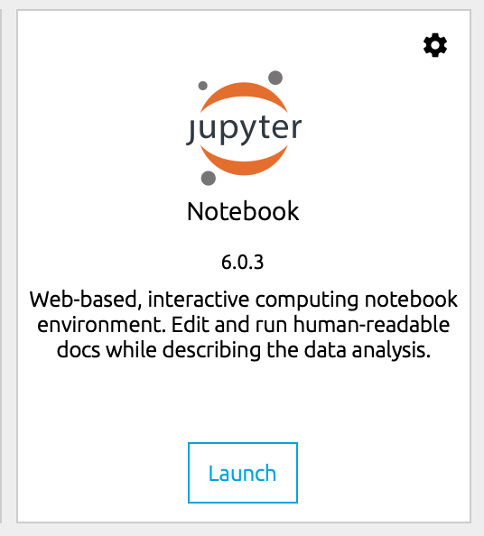
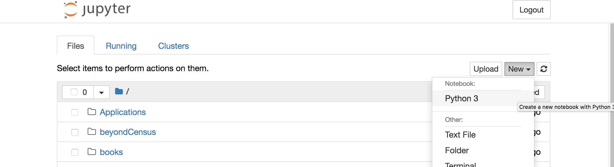
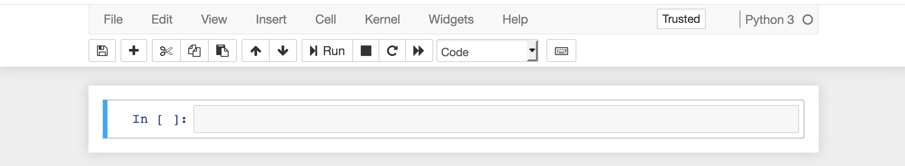
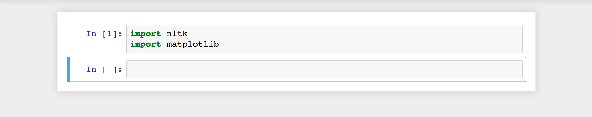
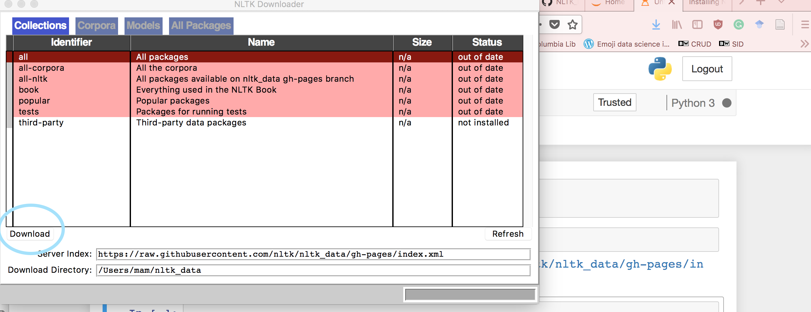
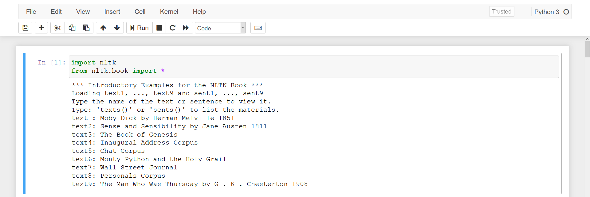

## Setup and installation

If you have not already installed the [Anaconda](https://www.anaconda.com/download/) distribution of Python 3, please do so.

You will also need [`nltk`](https://github.com/DHRI-Curriculum/install/blob/master/sections/nltk.md) and [`matplotlib`](https://github.com/DHRI-Curriculum/install/blob/master/sections/conda.md) to complete this tutorial. Both packages come installed with Anaconda. To check to be sure you have them, open a new Jupyter Notebook (or any IDE to run Python).

We suggest that you create a directory for the text analysis workshop. You might want to have this directory inside the `Documents` directory, or maybe you already have a `projects` directory. That is really up to you, and your personal preference. This workshop will assume you will create a folder called `text_analysis` on your `Documents` folder, but you should do as you wish. Note: the terms `directories` and `folders` are used interchangeably in the computing world, and we will do the same here.

Find Anaconda Navigator on your computer (it should be located in the folder with your other applications), and from Anaconda Navigator's interface, launch a Jupyter Notebook.



It will open in the browser. All of the directories (folders) in your `home` directory will appear. (This may vary depending on what OS you are using, as the file structure can be different)

We will now open a new file. It is very important that you make sure to open the file in the right place, so you can find it later. Navigate on the directories clicking on them until you are on the desired directory: in our case, `text_analysis`.

Once you are in the right place, select `New` >> `Python3` in the upper right corner.



A blank page with an empty box should appear.



In the box, type:

```python
import nltk
import matplotlib
```

Press `Shift + Enter` to run the cell (or click `run` at the top of the page). We just want to make sure the packages we will need are installed.



If nothing happens, they are installed and you are ready to move on! If you get an error message, check for possible typos. If you typed everything correctly and still got an error message, you probably don't have `nltk` and/or `matplotlib` installed. (As we mentioned before, both should come by default when you install `Anaconda`. A quick possible fix is to open your `terminal` (NOT the Jupyter Notebook file) and type:

```console
$ conda install nltk -y
$ conda install matplotlib -y
```

## Downloading the corpus

Now we need to install the nltk corpus. This is very large and may take some time if you are on a weak connection.

In the next cell, type:

```python
nltk.download()
```

and run the cell.

The NLTK downloader should appear. Please install all of the packages. If you are short on time, focus on "book" for this tutorial—you can download the other packages at another time for later use.

Yours will look a little different, but the same interface. Click on the 'all' option and then 'Download'. Once they all trun green, you can close the Downloader dialogue box.



Return to your Jupyter Notebook and type:

```python
from nltk.book import *
```

A list of books should appear. If this happens, great! If not, return to the downloader to make sure everything is ok.



Close this Notebook without saving — the only purpose was to check if we have the appropriate packages installed. You can save it if you want to come back in the future and see how you did it, but once you have them installed in your computer, you will not have to do that again.
