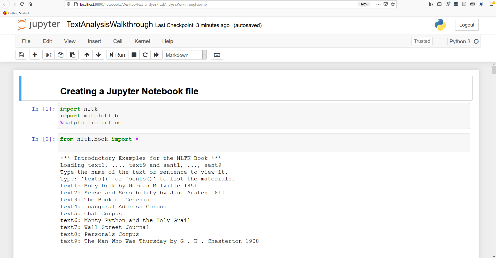
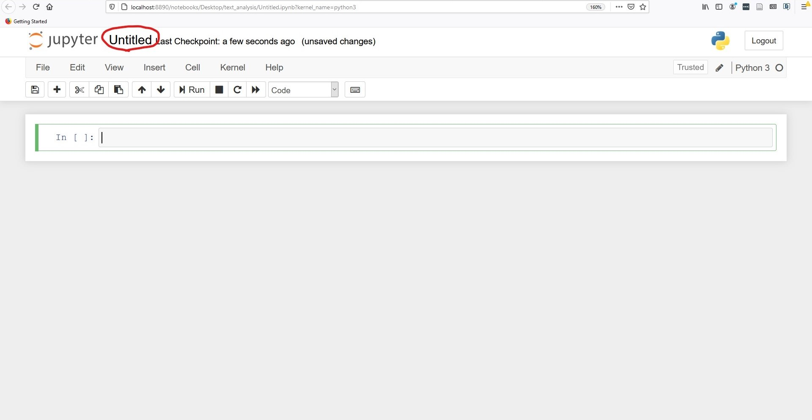

← [Cleaning and Normalizing](02-cleaning-and-normalizing.md)&nbsp;&nbsp;&nbsp;|&nbsp;&nbsp;&nbsp;[Searching for Words](04-searching-for-words.md) →

---

# 3. Using the NLTK Corpus

In the following sections, we are going to learn how to work with the NLTK Corpus and go through a series of methods that come built-in to NLTK that allow us to turn our words into numbers and visualizations.

All of the code for this section is in a [Jupyter Notebook file](https://github.com/DHRI-Curriculum/text-analysis/blob/v2.0/TextAnalysisWalkthrough.ipynb?raw=true). You should download it and save it on your desired folder. Here, we are assuming you are saving in in the `text_analysis` folder.

In this file you will find all of the workshop commands and the expected outputs. If you ever feel stuck or can't seem to be able to advance in the workshop, you can open this file and see how we did it. Feel free to open the file right now (click on it), take a peek at its contents if you want, and close it.

To do it, open your Jupyter Notebook, and navigate to the `text_analysis` directory. Click on the `TextAnalysisWalkthrough.ipynb` file. Once you are done, just close the tab.



For the best possible experience, we suggest/encourage you to:
- Create an ipynb file and follow the workshop typing all the code yourself.
- Avoid copying/pasting the code. Much of learning has to do with you typing yourself.
- Only check the `TextAnalysisWalkthrough.ipynb` file if you get lost or if you are not able to get the right output. Before opening it, put some time trying to figure out by yourself why it isn't working. A big part of coding is learning to identify what we are doing wrong.
- I would also caution you against working with both files open at the same time. It is easy to get confused and start modifying the wrong one.

But those are only suggestions. Maybe they will work for you, maybe they won't, so feel free to do as it best suit you. You are in charge here!

## Creating a Jupyter Notebook file

Now you will create your Jupyter notebook file, in which you will run the workshop. Return to the Jupyter Home Tab in your Browser (or, if you closed it completely, launch the Jupyter Notebook again), and start a New Python Notebook using the `New` button in the upper right corner.

Even though Jupyter Notebook doesn't force you to do so, it is very important to name your file, or you will end up later with a bunch of untitled files and you will have no idea what they are about. In the top left, click in the word `Untitled` and give your file a name such as "intro_nltk".



In the first blank cell, type the following to import the NLTK library:

```python
import nltk
```

**Libraries** are sets of instructions that Python can use to perform specialized functions. The Natural Language ToolKit (`nltk`) is one such library. As the name suggests, its focus is on language processing.

We will also need the `matplotlib` library later on, so import it now:

```python
import matplotlib
```

matplotlib is a library for making graphs. In the middle of this tutorial, we are going to make a dispersion plot of words in our texts.

Finally, because of a quirk of Jupyter notebooks, we need to specify that matplotlib should display its graphs in the notebook (as opposed to in a separate window), so we type this command (this is technically a Jupyter command, not Python):

```python
%matplotlib inline
```

All three of these commands can be written in the same cell and run all at once (<kbd>Shift</kbd> + <kbd>Enter</kbd>) or in different cells.


If you don't see an error when you run the notebook—that is, if there is no output—you can move on to the next step. It is not rare in programming that when you do things right, the result will be nothing happening. This is what we like to call a _silent success_.

Next, we need to load all of the NLTK corpora into our program. Even though we downloaded them to our computer, we need to tell Python we want to use them.

```python
from nltk.book import *
```

The pre-loaded NLTK texts should appear again. These are preformatted data sets. We will still have to do some minor processing, but having the data in this format saves us a few steps. At the end of this tutorial, we will make our own corpus. This is a special type of python object specific to NLTK (it isn't a string, list, or dictionary). Sometimes it will behave like a string, and sometimes like a list of words.


Notice that each of the texts already have a variable name. _Moby Dick_ is `text1`, _Sense and Sensibility_ is `text2`, and so on. When we want to work with those books, we will call them by their variable name, as you'll see soon.

If you got any error messages, check the code and make sure you typed everything correctly. Even spaces before words matter!

If you are sure you are running the code correctly, you probably have an installing issue, so you might have to go back to the instalation instructions to figure it out.

## Keywords

Do you remember the glossary terms from this section?

- [Corpus](https://github.com/DHRI-Curriculum/glossary/blob/v2.0/terms/corpus.md)
- [Jupyter Notebook](https://github.com/DHRI-Curriculum/glossary/blob/v2.0/terms/jupyter-notebook.md)
- [Library](https://github.com/DHRI-Curriculum/glossary/blob/v2.0/terms/library.md)
- [Matplotlib](https://github.com/DHRI-Curriculum/glossary/blob/v2.0/terms/matplotlib.md)

---

← [Cleaning and Normalizing](02-cleaning-and-normalizing.md)&nbsp;&nbsp;&nbsp;|&nbsp;&nbsp;&nbsp;[Searching for Words](04-searching-for-words.md) →