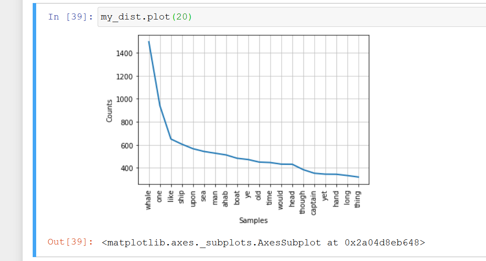

← [Data cleaning: Stemming Words](11-data-cleaning-stemming-words.md)&nbsp;&nbsp;&nbsp;|&nbsp;&nbsp;&nbsp;[Make Your Own Corpus](13-make-your-own-corpus.md) →

---

# 12. Data Cleaning: Results

Now that we've seen some of the differences between both, we will proceed using our lemmatized corpus, which we saved as `text1_clean`:

```python
my_dist = FreqDist(text1_clean)
```

If nothing happened, that is normal. Check to make sure it is there by calling for the type of the "my_dist" object.

```python
type(my_dist)
```

The result should say it is a nltk probability distribution (`nltk.probability.FreqDist`). It doesn't matter too much right now what that is, only that it worked. We can now plot this with the matplotlib function, `plot`. We want to plot the first 20 entries of the my_dist object.

```python
my_dist.plot(20)
```



We've made a nice image here, but it might be easier to comprehend as a list. Because this is a special probability distribution object we can call the `most_common` on this, too. Let's find the twenty most common words:

```python
my_dist.most_common(20)
```

What about if we are interested in a list of specific words—perhaps to identify texts that have biblical references. Let's make a (short) list of words that might suggest a biblical reference and see if they appear in _Moby Dick_. Set this list equal to a variable:

```python
b_words = ['god', 'apostle', 'angel']
```

Then we will loop through the words in our cleaned corpus, and see if any of them are in our list of biblical words. We'll then save into another list just those words that appear in both.

```python
my_list = []
for word in b_words:
    if word in text1_clean:
        my_list.append(word)
    else:
        pass
```

And then we will print the results.

```python
print(my_list)
```

You can obviously do this with much larger lists and even compare entire novels if you wish, though it would take a while with this approach. You can use this to get similarity measures and answer related questions.

## Challenge

1. Try to get the same result of the loop above (the one with "my_list"), but this time with a list comprehension. Save this other list as "my_list2".

2. Compare both lists to see if they are identical.

## Solution

1. A solution using a list comprehension would look like this:

    ```python
    my_list2 = [word for word in b_words if word in text1_clean]
    ```

2. To compare the lists, you could run the following command:

    ```python
    my_list == my_list2
    ```

## Evaluation

Check all sentences below that are correct:

- We can create a frequency distribution of a list of strings with `FreqDist` and plot it with the `plot` method.*
- `my_dist.most_common(50)` will check the first 50 words in the distribution and return you the most common one among them.

---

← [Data cleaning: Stemming Words](11-data-cleaning-stemming-words.md)&nbsp;&nbsp;&nbsp;|&nbsp;&nbsp;&nbsp;[Make Your Own Corpus](13-make-your-own-corpus.md) →